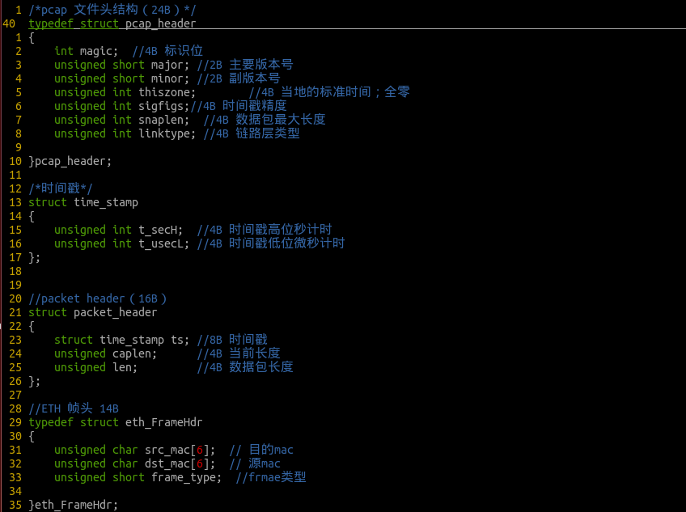
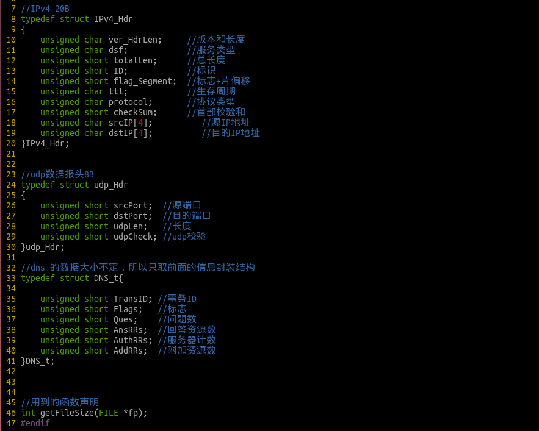
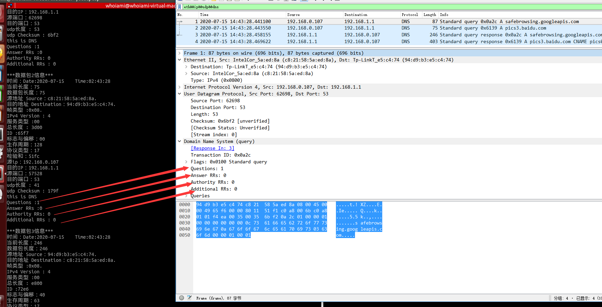
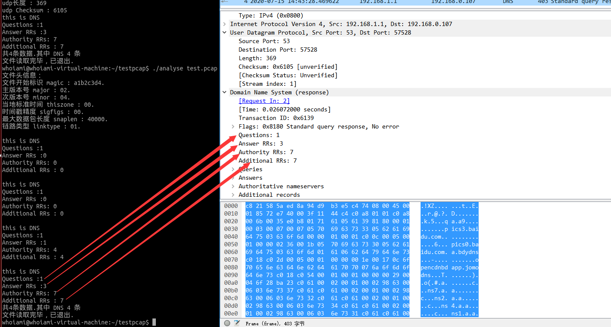

<h1 align<h1 align="center">Welcome to nightwish 👋</h1>

<p>
  
  </p>
    
⬇️[下载地址](https://github.com/Hiiam9/anaylseDNS/releases/tag/1.0)
#### 功能： 解析pcap文件<br>
-说明：这个程序来源于本人实习面试时的一道面试题，题目内容如下所述：
写一个pcap网络数据分析程序，读取一个有“ETH->IPV4->UDP->DNS”协议的pcap文件，把DNS协议中的“Questions/Answer RRs/Authority RRs/Additional RRs”打印出来，并找出识别为DNS协议的特征。

-开发环境：ubuntu 14.04

-编程语言：c

-编译器：gcc-4.8.4


##### 数据结构



#### 使用示例
-准备好pcap文件
-编译程序：make 
-参数：
    默认打印DNS主要参数
    -a打印全部信息

```
#analyse -a xxx.pcap
```




```
#analyse xxx.pcap
```


#### 跨平台
    未使用任何平台相关代码，具有良好的跨平台功能，Linux&Windows皆可以编译运行
